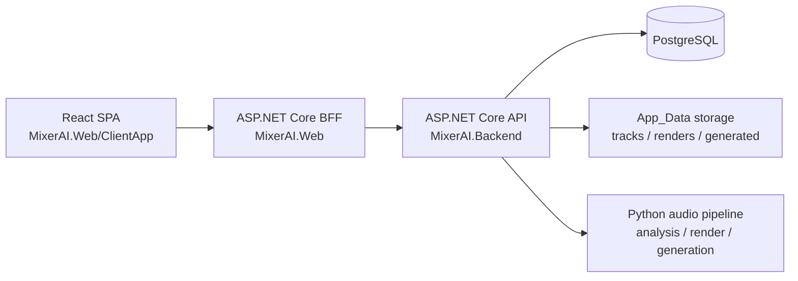

# MixerAI

MixerAI is a portfolio-oriented full-stack app for DJs and early-stage producers. It combines a React + TypeScript frontend, an ASP.NET Core BFF layer, a protected ASP.NET Core backend API, PostgreSQL persistence, and Python-based audio analysis/generation tooling.

The project is designed to demonstrate more than CRUD:
- authenticated workflows
- backend-for-frontend boundaries
- background processing for audio analysis
- file handling and audio proxying
- AI-assisted transition recommendations and reference rendering
- containerized local/demo deployment

## Portfolio Snapshot

**Current stack**
- Frontend: React + TypeScript + Vite in [src/MixerAI.Web/ClientApp](/c:/Users/Administrator/Desktop/Osobne/mixerAI/src/MixerAI.Web/ClientApp)
- Web shell / BFF: ASP.NET Core in [src/MixerAI.Web](/c:/Users/Administrator/Desktop/Osobne/mixerAI/src/MixerAI.Web)
- Protected API: ASP.NET Core + Identity + EF Core in [src/MixerAI.Backend](/c:/Users/Administrator/Desktop/Osobne/mixerAI/src/MixerAI.Backend)
- AI/audio tooling: Python scripts in [ai](/c:/Users/Administrator/Desktop/Osobne/mixerAI/ai)
- Tests: xUnit coverage in [tests/MixerAI.Backend.Tests](/c:/Users/Administrator/Desktop/Osobne/mixerAI/tests/MixerAI.Backend.Tests)

**What this demonstrates**
- migration from server-rendered MVC UI toward a modern SPA architecture
- a clear BFF boundary so the frontend never talks directly to the protected backend API
- session handling with server-managed auth cookies while backend bearer tokens stay off the client
- real workflow orchestration across .NET, Python, storage, and async processing

## Product Flow

1. Register or sign in through the React SPA.
2. Upload source tracks into the library.
3. Let the backend analyze BPM, key, waveform, and processing health in the background.
4. Load ready tracks into Deck A and Deck B.
5. Render an AI-assisted transition reference mix from the selected pair.
6. Ask the corpus-backed recommendation engine for promising transition candidates.
7. Generate producer sketches or a mini-mix inspiration asset.
8. Use the local mix analysis panel to inspect BPM, beat markers, and overlay timing before committing to a transition idea.

## Architecture



### Boundary design

- The browser only calls same-origin BFF endpoints under `/api/bff/...`
- The BFF keeps auth/session concerns inside `MixerAI.Web`
- `MixerAI.Backend` remains the protected system API for data, rendering, recommendations, and generation
- Audio preview is streamed through the BFF so the SPA can stay on one origin without exposing backend auth mechanics

### Main projects

- [src/MixerAI.Web/Program.cs](/c:/Users/Administrator/Desktop/Osobne/mixerAI/src/MixerAI.Web/Program.cs)
  SPA host + BFF routing + cookie auth
- [src/MixerAI.Web/Controllers/AuthController.cs](/c:/Users/Administrator/Desktop/Osobne/mixerAI/src/MixerAI.Web/Controllers/AuthController.cs)
  session, login, register, logout
- [src/MixerAI.Web/Controllers/LibraryController.cs](/c:/Users/Administrator/Desktop/Osobne/mixerAI/src/MixerAI.Web/Controllers/LibraryController.cs)
  library JSON endpoints and audio proxy
- [src/MixerAI.Web/Controllers/WorkspaceController.cs](/c:/Users/Administrator/Desktop/Osobne/mixerAI/src/MixerAI.Web/Controllers/WorkspaceController.cs)
  workspace snapshot, recommendations, render, generation, analysis
- [src/MixerAI.Backend/Program.cs](/c:/Users/Administrator/Desktop/Osobne/mixerAI/src/MixerAI.Backend/Program.cs)
  protected API, EF startup, Identity, AI endpoints
- [src/MixerAI.Web/ClientApp/src/App.tsx](/c:/Users/Administrator/Desktop/Osobne/mixerAI/src/MixerAI.Web/ClientApp/src/App.tsx)
  portfolio-facing SPA workflow

## Why This Is Portfolio-Worthy

This app is useful in a portfolio because it shows product thinking plus backend depth:

- it is a real workflow app rather than a toy dashboard
- it integrates multiple runtimes cleanly instead of pretending one stack does everything
- it shows architectural evolution: MVC prototype to SPA + BFF refinement
- it includes asynchronous and failure-aware behavior, not only happy-path CRUD

### Technical problems solved

- **Clear client/server boundary**
  The new frontend consumes BFF endpoints instead of reaching into backend internals directly.
- **Safer auth shape**
  Backend tokens stay in the server-side auth ticket rather than being exposed to browser scripts.
- **Same-origin media access**
  The BFF proxies library audio so deck previews work without cross-origin complexity.
- **Background analysis visibility**
  Tracks expose status, attempts, and retry actions so analysis failures become part of the UX instead of hidden server noise.
- **Mixed-technology orchestration**
  .NET handles auth, API boundaries and persistence while Python focuses on audio analysis and generation workloads.

## Frontend Rewrite Notes

The original frontend used server-rendered Razor views. The current frontend is a React + TypeScript SPA that focuses on:

- clearer naming for presentation and demos
- a more modern visual surface
- better separation between UX and server orchestration
- a stronger story for a medior .NET engineer who can still work comfortably with modern frontend architecture

## Screenshots

Recommended screenshot set lives in [docs/screenshots/README.md](/c:/Users/Administrator/Desktop/Osobne/mixerAI/docs/screenshots/README.md).

Suggested captures:
- signed-out landing page
- authenticated dashboard hero
- transition lab with two deck selections
- recommendation results
- mix analysis panel with waveform markers
- library table showing retry/error states

## Demo Deploy

### Local demo with Docker

```powershell
docker compose up --build
```

Services:
- Web SPA + BFF: `http://localhost:5000`
- Backend API: `http://localhost:8080`
- PostgreSQL: `localhost:5432`

### Local development without Docker

Backend:

```powershell
$env:DOTNET_CLI_HOME='c:\Users\Administrator\Desktop\Osobne\mixerAI'
dotnet run --project src/MixerAI.Backend
```

Frontend/BFF:

```powershell
$env:DOTNET_CLI_HOME='c:\Users\Administrator\Desktop\Osobne\mixerAI'
dotnet run --project src/MixerAI.Web
```

React client:

```powershell
cd src\MixerAI.Web\ClientApp
npm.cmd install
npm.cmd run build
```

### Recommended hosted demo topology

- deploy `MixerAI.Backend` and PostgreSQL together on one container-friendly host
- deploy `MixerAI.Web` as the public entrypoint
- keep the backend private to the public internet when possible
- use the public `MixerAI.Web` URL in portfolio links and demo videos

## Testing

Run the current checks with:

```powershell
$env:DOTNET_CLI_HOME='c:\Users\Administrator\Desktop\Osobne\mixerAI'
dotnet test tests/MixerAI.Backend.Tests/MixerAI.Backend.Tests.csproj
```

Frontend build:

```powershell
cd src\MixerAI.Web\ClientApp
npm.cmd run build
```

## Notes For Interview / CV Use

You can reasonably describe this project as:

> Built a full-stack AI-assisted DJ workspace with a React/TypeScript frontend, an ASP.NET Core BFF, a protected ASP.NET Core backend API, PostgreSQL persistence, background track analysis, and Python-based audio rendering/generation workflows.

That framing is accurate and much stronger than underselling it as “just a hobby app”.
